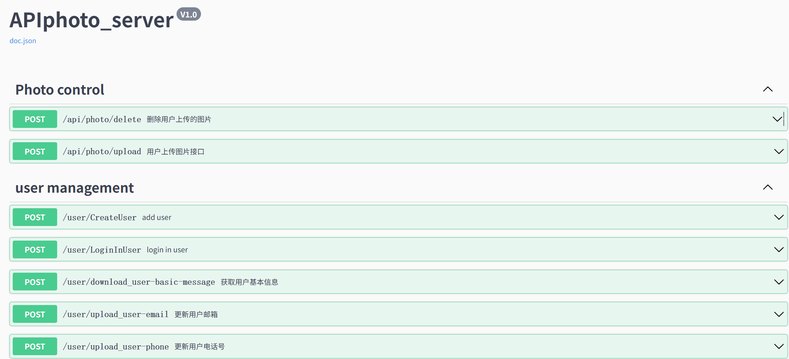

# PhotoShareAndCommunicate📸🌐

[](https://golang.org/)
[](https://gin-gonic.com/)
[](https://gorm.io/)
[](https://redis.uptrace.dev/)

一个基于 Go 语言与 Gin 框架的全栈照片分享与社交平台，支持用户上传、管理、以及相互交流。

---

## 目录

- [核心概述](#项目概述)
- [核心功能](#核心功能)
- [技术栈](#技术栈)
- [快速开始](#快速开始)
    - [环境要求](#环境要求)
    - [安装依赖](#安装依赖)
    - [配置说明](#配置说明)
    - [启动服务](#启动服务)
- [API 文档](#API文档)
- [数据库设计](#数据库设计)
- [开发指南](#开发指南)
    - [代码结构](#代码结构)
- [致谢](#致谢)

## 项目概述
- **目标**：打造一个高性能、易扩展的照片分享与社交平台
- **核心场景**：
    - 用户上传照片
    - 管理照片
    - 交流互动
    - 实时消息通知
- **特色**：
    - 支持多格式图片处理
    - 权限分级管理
    

---
## 核心功能
### 用户模块
- 注册/登录（JWT 认证）
- 个人资料管理（头像、简介）
- 社交关系（关注、粉丝列表）

### 照片模块
- 照片上传（支持 JPEG/PNG）
- 智能排序（标签、点击数）
- 隐私设置（公开/私有）

### 社区模块
- 评论与点赞
- 实时通知（WebSocket）

---
## 技术栈
| 类别       | 技术/工具                |
|------------|--------------------------|
| **后端**   | Go 1.21+, Gin, GORM      |
| **数据库** | MySQL 8.0, Redis（缓存） |
| **DevOps** | Docker, GitHub Actions   |
| **其他**   | WebSocket        |

---

## 快速开始
### 环境要求
- Go 1.21+
- MySQL 8.0
- Redis 6.2+

### 安装依赖
```bash

git clone https://github.com/Huravar/PhotoShareAndCommunicate.git
cd PhotoShareAndCommunicate
go mod download

```

### 配置说明
配置项示例：
```yaml
mysql:
  username: "root"
  password: "1111"
  network_protocal: "tcp"
  server_address: "127.0.0.1"
  server_port: "3306"
  database_name: "gin_uploadphoto"
  character: "utf8mb4"
redis:
  addr : "127.0.0.1:6379"
  password: ""
  db: 0
  poolSize: 200
  midIdleConn: 50
```

### 启动服务
```bash

go run main.go
```
## API文档
访问[ Swagger UI](http://localhost:8080/swagger/index.html)查看完整 API 文档：


---
## 数据库设计

主要数据表结构：

| 表名                   | 描述         | 关键字段          |
|----------------------|------------|---------------|
| basicuserinformation | 用户基础信息     | 用户名 密码 手机号等   |
| user_home_page_info  | 用户主页信息     | 头像文件路径 自我介绍等  |
| usernetwork          | 用户登录时的网络信息 | 登录IP 端口 登录状态等 |
| userphotoinfo        | 用户上传图片信息   | 文件名 文件路径 点击数等 |
## 开发指南
### 代码结构
- ⚙️config → 包含数据库连接、Redis密钥等敏感配置
- 🔒crypt → 有关数据加密解密的相关操作，如token的生成等
- 📚docs → swagger生成的文件夹也为操作目录
- 🧰gadget → 用到的工具函数
- 🏛️model → 项目中主要结构体的定义，与数据库相同
- 🖼️picture_handle → 有关图片的基本操作
- 🚦router → 后端路由的定义
- 🛠️service → 路由定义功能的实现
- 📸user_static_info → 用户图片，头像的存放文件夹以及操作的函数
- 🔌utils → 工具的初始化

**如有疑问请联系：huravarzhang@outlook.com**

